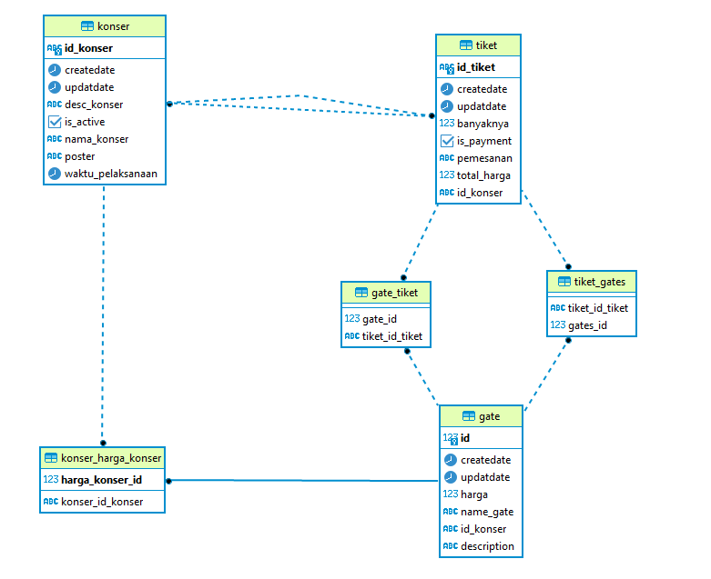

# tiketKonser

API example
# search
url : localhost:8080/konser/search?search=konser a
method : GET

# create konser
url : localhost:8080/konser/create
method : POST
body : 

{
"namaKonser": "KONSER KKKK",
"descKonser": "KONSER RAKYAT",
"poster": "-",
"waktuPelaksanaan": "2024-01-31 14:50:09",
"hargaKonser": [
{  
"nameGate": "TRIBUN A+",
"harga": 200000
},
{

            "nameGate": "TIBUN B+",
            "harga": 300000
        },
        {
          
            "nameGate": "TRIBUN C+",
            "harga": 450000
        },
         {
          
            "nameGate": "TRIBUN C",
            "harga": 400000
        }
    ],
    "active": true
}

# update
url : localhost:8080/konser/update/b009b67f-5c14-441d-b3c1-7d7cfc2048c6
method : POST
body :
{

    "namaKonser": "KONSER KKKK",
    "descKonser": "KONSER RAKYAT",
    "poster": "-",
    "waktuPelaksanaan": "2024-01-31 14:50:09",
    "hargaKonser": [
        {
            "id": 17,
            "nameGate": "TRIBUN A+",
            "harga": 200000
        },
        
        {
            "id": 18,
            "nameGate": "TIBUN B+",
            "harga": 300000
        },
        {
            "id": 19,
            "nameGate": "TRIBUN C+",
            "harga": 450000
        },
        {
            "id": 20,
            "nameGate": "TRIBUN C+",
            "harga": 400000
        },
        {
            
            "nameGate": "TRIBUN CUS+",
            "harga": 400000
        }
    ],
    "active": true
}

# delete
url : localhost:8080/konser/delete/3114f1ae-5033-460a-ad43-b275addd513c

method : DELETE

# find by id
url : localhost:8080/konser/find/10897c4d-17e4-4e6d-bc49-68136ffa2dce
method : GET

# pemesanan
url : localhost:8080/tiket/pemesanan/10897c4d-17e4-4e6d-bc49-68136ffa2dce
method : POST
body :
[
{
"gateId": 55,
"banyaknya": 1
},
{
"gateId": 56,
"banyaknya": 3
}
]

# RELATIONAL DATABASE CONCEPT

